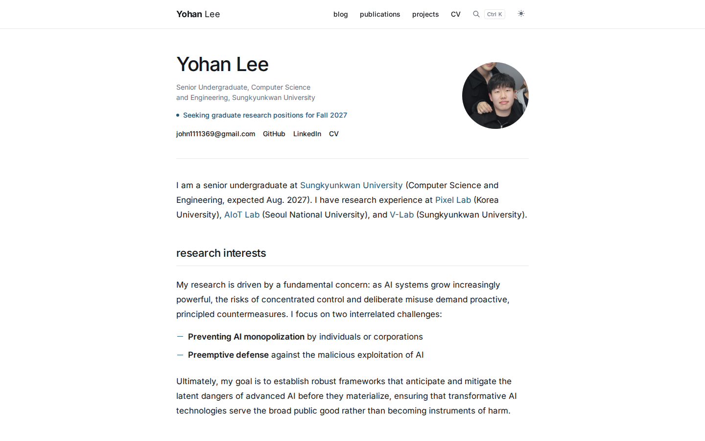
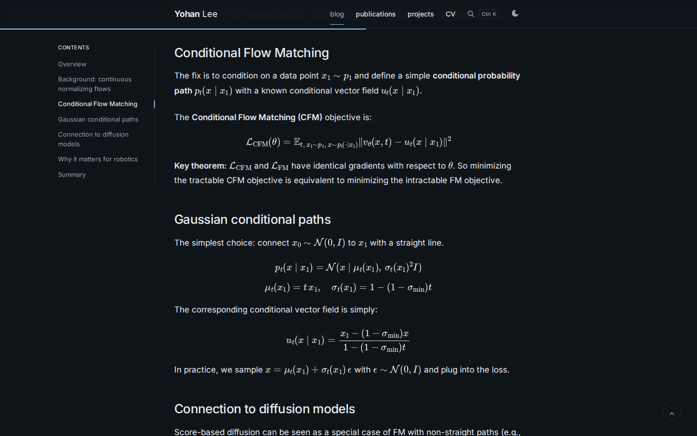

# Yohan Lee · academic website

Personal research website built with [Jekyll](https://jekyllrb.com/) on top of [al-folio](https://github.com/alshedivat/al-folio).
Blog posts use the [Distill](https://distill.pub/) article format; every other page shares one quiet, typographic design.

**Live site:** <https://yh-lee01.github.io> · [한국어 README](README.ko.md)

| Home (light) | Distill post (dark) |
| --- | --- |
|  |  |

## Features

- **One reading column** (720px) for every page; navigation and footer align to it.
- **Distill posts** with a sticky contents list that marks the current section, section links (`#`), MathJax, and an optional "paper reviewed" card.
- **Publications** from BibTeX (jekyll-scholar): thumbnails, abstract/BibTeX toggles, one-click BibTeX copy; the filter appears once there are 5+ papers.
- **Projects** as rows with an image or a YouTube thumbnail and an embedded demo video.
- **News**, tag/category/year archives, CV as a PDF (with a mobile-friendly open button), `Ctrl K` search, light/dark/system theme, RSS.
- **Design tokens** for type scale, spacing and colors, so pages stay consistent.

## Quick start

Requirements: Ruby 3.3, Bundler, Python 3 (for `nbconvert`), ImageMagick (`convert`, for responsive WebP images).

```bash
bundle install
python -m pip install -r requirements.txt
bin/site serve        # http://localhost:4000 with live reload (PORT=4001 bin/site serve to change the port)
```

```bash
bin/site build        # production build → _site/
bin/site check        # production build + the CSS check CI runs before deploying
```

`bin/site` switches to a UTF-8 locale when needed (otherwise BibTeX parsing fails with "invalid byte sequence").
Machine-specific environment variables can go in `.bundle/local-env.sh` (not committed).

## Where things live

| What | Where | Guide |
| --- | --- | --- |
| Name, site URL, description, features | `_config.yml` (top section) | [Using this as a template](docs/USING-THIS-TEMPLATE.md) |
| Home page text, status line, profile photo | `_pages/about.md`, `assets/img/` | [Content guide](docs/CONTENT.md#home-page) |
| Blog posts | `_posts/` | [Content guide](docs/CONTENT.md#blog-posts) |
| Publications | `_bibliography/papers.bib`, `assets/img/publication_preview/` | [Content guide](docs/CONTENT.md#publications) |
| Projects | `_projects/` | [Content guide](docs/CONTENT.md#projects) |
| News | `_news/` | [Content guide](docs/CONTENT.md#news) |
| CV | `assets/pdf/`, `_pages/cv.md` | [Content guide](docs/CONTENT.md#cv) |
| Email, GitHub, LinkedIn, Scholar | `_data/socials.yml` | [Content guide](docs/CONTENT.md#links-and-co-authors) |
| Colors, fonts, sizes, spacing | `_sass/site/_tokens.scss` | [Design guide](docs/DESIGN.md) |
| Page structure, shared components | `_layouts/`, `_includes/` | [Design guide](docs/DESIGN.md#components) |

```text
_config.yml                site settings (edit the top section; the rest is theme wiring)
_pages/                    home, blog, publications, projects, news, CV, 404
_posts/ _projects/ _news/  content collections
_bibliography/             papers.bib
_data/                     socials, co-authors, venues
_layouts/ _includes/       page templates and shared components
_sass/site/                this site's styles: tokens, foundation, home, collections, reading
_sass/*.scss               al-folio, Distill and icon styles, kept as upstream
assets/js/                 site scripts (toc-spy, heading-anchors, copy_code) and upstream scripts
docs/                      guides and README images (not published)
bin/site                   serve / build / check
```

## Deploy

`.github/workflows/deploy.yml` runs on every push to `master`/`main`: production build, unused-CSS purge, a CSS integrity check, then GitHub Pages. Local `bin/site` commands never deploy.

Check changes with `bin/site check` (or `build`), not only `serve`: the development server skips production minification, where layout bugs have appeared before.

## Credits and license

- Theme and code: [al-folio](https://github.com/alshedivat/al-folio) (MIT), the Distill template, Font Awesome, Tabler Icons and Academicons. See `LICENSE`.
- This site's templates and styles are MIT as well; reuse them freely.
- **Content is personal**: text, photos, CV, posts and publication data are © Yohan Lee. Replace them when you reuse this repository ([checklist](docs/USING-THIS-TEMPLATE.md)).
